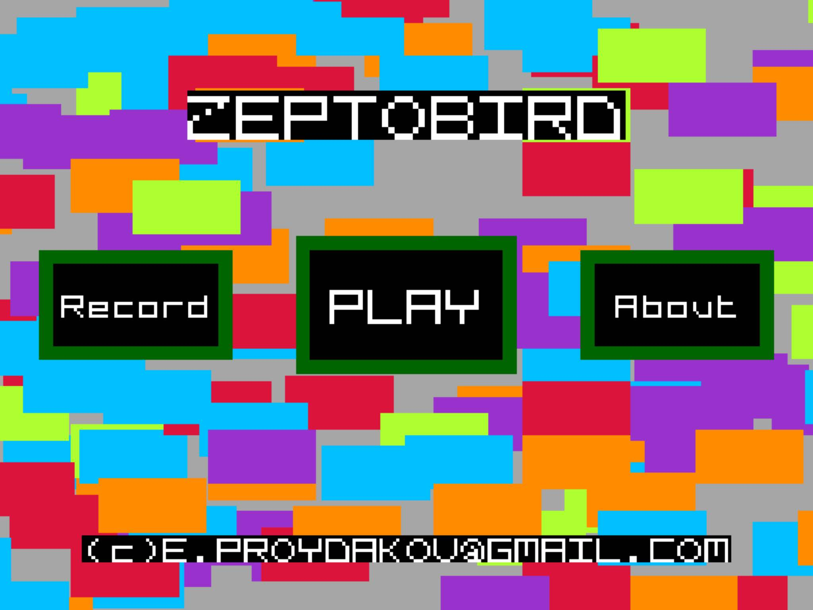
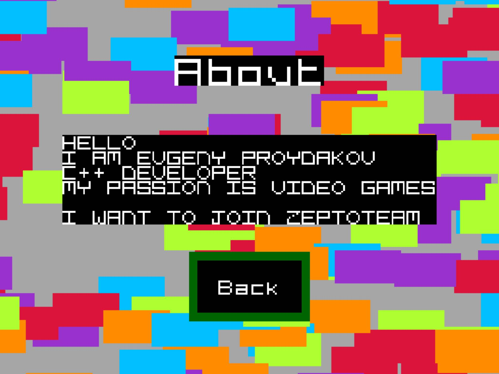
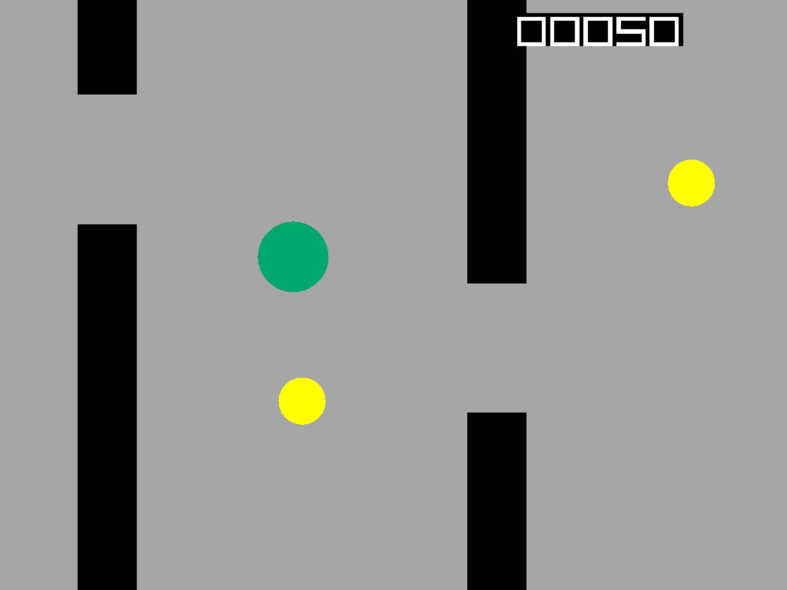
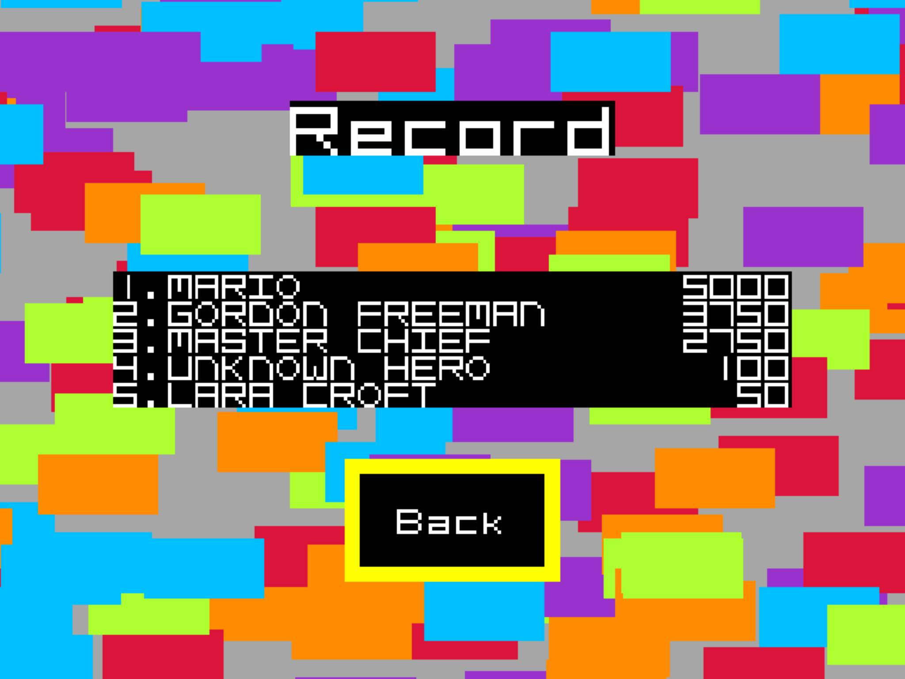

# ZeptoBird Game

ZeptoBird is yet another flappy bird clone.

Platforms
---------

ZeptoBird is written on **C++17** and **OPENGLES 2.0**. Release for *IOS* and *Android*.

iOS
---

Open **platforms/ios/zeptobird.xcodeproj** in XCode

Android
-------

Open **platforms/android/settings.gradle** in Android Studio. (note RC2.2 support C++ debug)

SDL2 (linux, windows, macosx)
----------------------------

    mkdir build-sdl2
    cd build-sdl2
    cmake ..
    make -j

HTML5
-----

Install **emscripten sdk**. https://kripken.github.io/emscripten-site/docs/getting_started/downloads.html

    mkdir build-html5
    cd build-html5
    cmake -DCMAKE_TOOLCHAIN_FILE=path/to/emsdk_portable/emscripten/master/cmake/Modules/Platform/Emscripten.cmake -DCMAKE_BUILD_TYPE=Release ..
    make -j

**Live Demo**: https://proydakov.github.io/zeptobird

Game Play
---------

License
-------

Copyright (c) 2016 Evgeny Proydakov

[LICENSE](LICENSE)

[0]: https://github.com/proydakov/zeptobird
